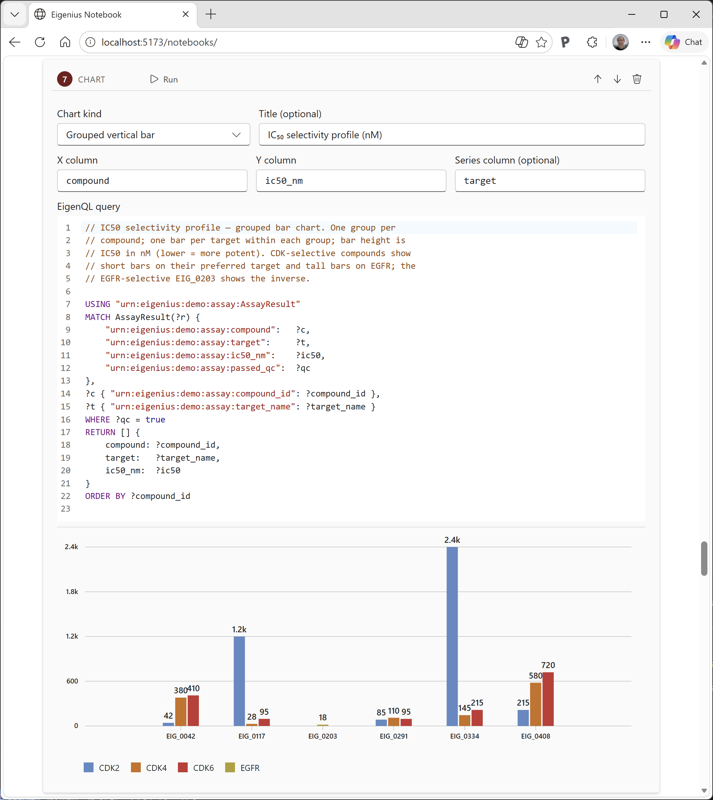

  

# Eigenius — AI Platform for Science and Engineering

An open-source **AI platform for science and engineering** built on a typed, queryable knowledge graph.

Contemporary LLMs produce text that reads like knowledge but carries no epistemic warranty — there is no structural way to distinguish a correct derivation from a convincing hallucination. Eigenius addresses this by anchoring knowledge in a typed, queryable knowledge graph where every fact has tracked provenance, every derivation is replayable through a typed pipeline, and formal proofs provide machine-checked certainty.

The platform maintains four epistemic categories:

- **Declared** — human assertions
- **Observed** — facts with provenance
- **Derived** — conclusions from typed pipelines with full audit trails
- **Verified** — derivations with machine-checked formal proofs

For frontier research in quantum physics, life sciences, materials science, and beyond, this distinction makes it possible to know what has been truly verified versus what is plausible-sounding text without proper grounding.

**Current status (April 2026):** Phases 0–11e complete. The platform is operational end-to-end — kernel, orchestrator, LLM integration, and CLI connected via gRPC; type-checked programs with dependent types, sized inductives and codata; institution dispatch through ESL and EigenQL; durable RocksDB persistence; WASM-sandboxed extensions; deployable via Docker Compose. See the [implementation plan](../design/implementation-plan.md) for the full phased build plan and the [top-level README](https://github.com/eigenius/eigenius#readme) for the live capability list.

> This is still a very early stage of this project. Anticipate
> features not working or missing functionality overall. Our goal
> is to close those quality gaps rather aggressively. Feel free
> to submit issues in the discussion forum or directly as issue.

---

## Start here — the notebook

For most users, the notebook is the most accessible way to use the platform. A React SPA bundled into the orchestrator image and served at `http://localhost:8080/notebooks/` once `docker compose up -d` is running. Cells (markdown, ESL, EigenQL, TypeScript, program-run) drive the kernel; outputs auto-render as typed inspectors, result tables, layer-stack diagrams, and program-trace trees.

  

→ **[Platform guide chapter 14 — Notebook](platform/14-notebook.md)** for the full reference.
→ **[Platform guide chapter 15 — TypeScript SDK](platform/15-typescript-sdk.md)** if you want to drive the kernel programmatically with the same `Eigen` class the notebook uses.

## User guides

Three task-first guides, grounded in the implementation. Every claim links to the kernel module, CLI command, example crate, or test that implements it.

### [Platform user guide →](platform/README.md)

How to install, run, manage, and extend the platform: the CLI, the kernel server, the orchestrator, RocksDB persistence, WASM components and institutions, deployment via Docker Compose or Azure ContainerApps, the notebook UX, the TypeScript SDK.

**Fifteen chapters covering**: installation, build/test workflow, CLI reference (every `eigenius` subcommand), running locally (three-terminal model + Docker Compose), database management (`serve --db`, drift refusal, exports), the orchestrator (LLM dispatch + MCP server), three end-to-end demo walkthroughs, building WASM components (pure / read / IO levels), building WASM institutions, deployment, troubleshooting, environment-variable and source-file index, the React notebook (cell types + file format + publish-to-layer + the patent demo), the TypeScript SDK (`@eigenius/client` API + worked examples).

Most important chapters: **[14. Notebook](platform/14-notebook.md)** + **[15. TypeScript SDK](platform/15-typescript-sdk.md)** for the typical first-touch UX, **[4. CLI reference](platform/04-cli-reference.md)** for everyday CLI operations, and **[9. Building WASM components](platform/09-wasm-components.md)** + **[10. Building WASM institutions](platform/10-wasm-institutions.md)** for extending the kernel.

### [ESL — Eigenius Surface Language →](esl/README.md)

The surface syntax for declaring ontologies, defining typed programs, and constructing resource instances. Compiles to Eigon-JSON resources that the Mini-TT kernel type-checks and evaluates.

**Eleven chapters covering**: HCL-style declarations (`namespace`, `class`, `property`, `resource`, `data`, `codata`, `program`); the ML-style expression sublanguage (`let`, lambdas, pattern match, constructor application, projection, `corecord`, etc.); the bridge between the resource graph and the kernel's type theory; the four capability modes (`Pure`/`Read`/`Check`/`IO`); institution-dispatched decide predicates and comorphisms; common error messages.

Most important chapter for understanding *how Eigenius differs from a standalone type-theory or a standalone knowledge graph*: **[chapter 6 — Resources, types, and the layer](esl/06-resources-types-and-the-layer.md)**.

### [EigenQL — query language →](eigenql/README.md)

The read-only query language over the layered Eigon knowledge graph. Pattern matching with `MATCH`, derived relations with `DEFINE`, institution dispatch via `FIBER` clauses and qualified-name function calls.

**Twelve chapters covering**: lexical structure; clause-by-clause program structure (`USING`, `MATCH`, `WHERE`, `FIBER`, `RETURN`, `GROUP BY`, etc.); pattern matching against typed and untyped resources; the expression sublanguage; FIBER clauses (institution dispatch with transient overlay); decide predicates and comorphisms in expression position; stratification rules for recursion + negation; the result-document format; error messages.

## How the guides relate

The **platform** guide is operational — it covers everything *around* writing ESL/EigenQL: installing, running, managing data, deploying, building WASM extensions. The **ESL** and **EigenQL** guides are surface-language references — they cover what you write *into* the system.

ESL **computes**; EigenQL **retrieves and filters**. They share the same kernel primitives — most importantly the institution capability classification, which means the same qualified-name IRI dispatches identically from both languages ([ESL §9.8](esl/09-institutions.md), [EigenQL §8](eigenql/08-institutions.md)).

If you're new to the platform: start with [platform chapter 14](platform/14-notebook.md) (the notebook UX) — it's the lowest-friction first touch. Then read [platform chapters 1, 2, 5](platform/01-introduction.md) for orientation, install, and the kernel/orchestrator topology under the notebook, and dip into [ESL chapters 1, 6](esl/01-introduction.md) + [EigenQL chapters 1, 2](eigenql/01-introduction.md) when you want to write your own ontologies, programs, and queries.

## Beyond the guides

Spec-first design documents in [`docs/design/`](../design/) cover the underlying architecture and the per-subsystem decisions:

- [D7 ESL surface syntax](../design/d7-esl-surface-syntax.md) — authoritative grammar, complementary to the ESL guide
- [D2 EigenQL specification](../design/d2-eigenql-specification.md) — authoritative grammar and semantics, complementary to the EigenQL guide
- [D18 Ontology-as-types resolution](../design/d18-ontology-as-types-resolution.md) — the bridge mechanism explained in ESL chapter 6
- [D19 Inductive and sized types](../design/d19-inductive-types.md) — type theory underpinning ESL `data`/`codata` declarations
- [D10 Grothendieck institution protocol](../design/d10-grothendieck-institution-protocol.md) — institution mechanism dispatched in both guides
- [D22 Notebook UX and TypeScript SDK](../design/d22-notebook-and-typescript-sdk.md) — spec for the notebook + `@eigenius/client`, complementary to platform chapters 14 + 15

The full set (D1–D22 plus standalone notes including the [Lean 4 as institution](../design/lean-4-as-institution.md) integration plan) lives at [`docs/design/`](../design/).

Source code: [github.com/eigenius/eigenius](https://github.com/eigenius/eigenius).
